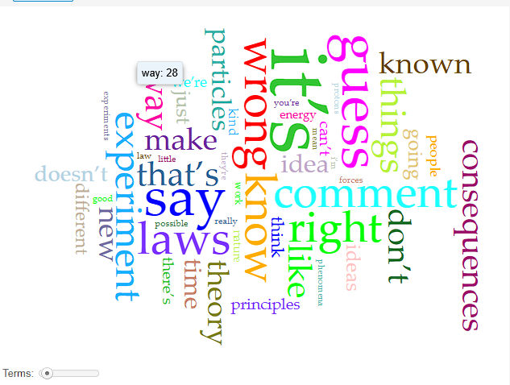



# Distant Reading Assignment 

I am very interested in philosophy and quantum physics so I was torn between choosing a topic. But I ended up settling for quantum physics. I have included [this hyperlink.. (right here)](https://jamesclear.com/great-speeches/seeking-new-laws-by-richard-feynman) to a transcript of a speech titled "Seeking New Laws" delivered by Richard Feynman on November 9, 1964.

Okay, enough talk about science, time to talk about the analysis from Voyant Tools. Below is a picture of the "circus" of words:

This picture clearly shows the general topics of the speech. It is almost as if you could jump from word to word and make a sentence, which sounds similar to something Richard Feynman said in his lecture. The top five words are, "it's," "say," "guess," "right," and "wrong." While there are not many negative words in the top five, one thing I noticed is the abundance of negative words. Perhaps this makes sense because he is trying to change the worlds' minds about physics. But something that cannot be known from these results is whether or not he was asking a rhetorical question using negative words. Another piece of information which can not be assumed is whether this speech was rehearsed or spontaneous. It sounds spontaneous but spontaneity can be rehearsed. Overall the results from Voyant give a good insight as to what Richard Feynman said in his lecture.

---
# AI Response
I pasted a link to the lecture inside Copilot and I asked it to analyze the lecture. It answered by explaining what Feynman said, and what the main topics were. So, I asked the AI to analyze deeper, drawing connections that would not normally be made. This is one response I recieved:

"The stated topic is discovering new laws. But there is a puzzle. Nearly half the speech is spent discussing:

How theories fail.

How scientists are fooled.

Vague explanations.

Wrong ideas.

Uncertainty.

Ignorance.

Why? If the goal were teaching physics, this is inefficient.

This suggests the real enemy is not ignorance.

The real enemy is self-deception.

The speech can be reinterpreted as:

"The greatest obstacle to discovering truth is not lack of intelligence. It is the tendency to fool ourselves into thinking we already have it."

That theme appears over and over."

Copilot affirmed what I said earlier, a majority of the most common words were negative. The AI's response lets us view what he said in a different way. It points out that his lecture is not truly about science it is about knowledge and sometimes how humans manipulate and believe false knowledge, simply because we want it to work. Whatever "it," may be.

---
These results help paint a picture for what to expect when using distant reading. You will not be able to fully understand the point/s the author is trying to make but the general idea or topic can be easily understood. Copilot helped analyze and breakdown the text. It also helped look deeper past the surface meaning and into what Feynman was truly saying. While these tools excel at giving the big picture they take the human aspect out of the equation. Each person has different experiences and ways of interoperating information, this is removed when these tools are used. These unique perspectives are what makes us human and is also what makes us exceptional at understanding what other people have to say.
